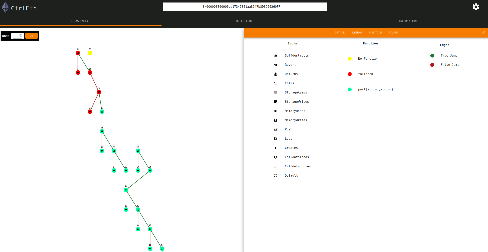

[](https://opensource.org/licenses/MIT) [](https://www.python.org/downloads/release/python-3100/)

# CtrlEth

This is the repository of a project that involved the development of a user interface for the Ethpector python library: https://github.com/uibk-ethpector/ethpector.
The developed interface currently can only be run locally, but is planned to be deployable at some point in time.
Main use of this interface is to simplify the usage of the Ethpector library to be able to analyse any Ethereum Smart Contracts efficiently.
Currently the user interface allows to start an analysis by calling the backend. After some time the analysis is stored in the cache of the backend and then the result can be visulized in the interface in the form of a control flow graph.
Some basic block explorer functionalities like viewing source code and recent transactions and events are implemented too.



## Installation

The Interface consists of a Flask backend that provides the functions of the Ethpector library and of a React frontend that
visualizes the information it receives from the backend. Following are detailed guides for the setup of the backend and the frontend.

### Backend
It is recommended to create a new virtual environment for the backend or use the provided dockerfiles for running the backend in a docker container.
It is much easier using the docker container because Ethpector has many dependencies that can cause problems during installation.
When installing locally and having issues, looking at the docker files can be useful.
For correctly running everything there are some addition configurations mentioned in the [backend usage section](#backend-1).

#### Libraries needed for api endpoint
The libraries needed are in the [requirements.txt](backend/ethpector_backend/requirements.txt) file.

This can be installed using pip:
```
python3 -m pip install requirements.txt
```

If docker is not used it is required to run a Redis server and a MongoDB server.
On Ubuntu redis installable with `sudo apt install redis-server`
For installing MonogoDB see the community server page of [MongoDB](https://www.mongodb.com/try/download/community).

## Frontend
For the React frontend nodejs and npm need to be installed. (https://nodejs.org/en/).

All dependencies can be installed by using:

```bash
npm install
```


## Usage

### Backend

Before starting the backend it is required to add a .env file with all the variables set like shown in the [config files section](#config-files).
All variables except the Mythril variables are currently required to be defined in the env file.
The Mythril variables are recommended as custom defaults but are not required.
All variables except the database credentials, the token and the rpc url can be used like in the example in the config files section. For the credentials a user and a secure password should be defined.
 A free etherscan token can be obtained by creating an account at https://etherscan.io/. Etherscan provides metadata and source code that are required for the functionalities provided by the backend. Without these the backend is not fully functional.
A rpc url can be obtained by creating a free account at infura https://infura.io/product/ethereum or another option is to run an Ethereum node. For a guide concerning this, the official Ethereum documentation for [running a node](https://ethereum.org/en/developers/docs/nodes-and-clients/run-a-node/) is a good starting point.

#### Docker

To use docker, first the directory must be changed to the [backend/src folder](backend/src/). Here the container needs to be build by using `docker-compose build`.
Afterwards the container can always be started by using `docker-compose up` in the same folder.
Our docker image includes a web tool called [flower](https://flower.readthedocs.io/en/latest/) to monitor celery tasks. Flower is useful because it logs all occurring tasks and allows to check for errors on failed tasks.
#### Local/ Debug
For debugging the application, it is required to run everything locally.

Because celery and flask have shell scripts that start them, they need special configurations for debugging.
Vscode was used for this and the debug settings can be found in the [launch.json](debug/launch.json) in the debug folder.
Before starting, the virtual environment mentioned above needs to be activated:
`source path-to-your-venv/bin/activate` <br>

To start just type `flask run` while being in the [backend/src folder](backend/src/).
This launches an endpoint on localhost:5000.
Then redis-server needs to be launched from the [backend](backend/) folder by typing
`redis-server src/redis.conf`. The second line is the redis-conf which is required to persist all saved lookups (because Ethpector can take very long for a lookup, docker uses same config)
At the end celery needs to be started again from the [backend/src folder](backend/src/) using
`celery -A app.celery worker -Q transient --loglevel=info`.
Redis entries can be managed by starting redis-cli in terminal. KEYS * lists entries and DEL \<key-name\> can be used to delete entries.

When wanting to debug, the vscode debug script for flask or celery can be used instead of using the commands. The advantage here is that the breakpoints in vscode will work allowing proper debugging.

#### Testing
There are some tests for the backend defined that can be started running `pytest` in the [backend/src folder](backend/src/).

#### Example calls

Example call to load the source code of the cryptopunks contract:
http://127.0.0.1:5000/source/0xb47e3cd837dDF8e4c57F05d70Ab865de6e193BBB

#### Config files
For the config file there are differences in the configuration when running locally and when running with docker.

General config settings:
```bash
FLASK_APP=app
FLASK_ENV=development
FLASK_CONFIG=development
ETHERSCAN_TOKEN=<your-token>
ETHPECTOR_RPC=<your-node-url>
```

Variables for docker:
```bash
FLASK_HOST=redis
DB_HOST=mongodb
CELERY_BROKER_URL=redis://redis:6379/0
CELERY_RESULT_BACKEND=redis://redis:6379/0
```

Variables for local setup:
```bash
FLASK_HOST=localhost
DB_HOST=localhost
CELERY_BROKER_URL=redis://localhost:6379/0
CELERY_RESULT_BACKEND=redis://localhost:6379/0
```

For mongodb it is required to define a password protecting the database from unauthorized users:

```bash
MONGO_INITDB_ROOT_USERNAME=user
MONGO_INITDB_ROOT_PASSWORD=securepassword
```

Specific configurations for Ethpector for the used Mythril library, which can be fine tuned to
have longer timeouts, deeper state checking etc (the repository of Ethpector should be used as reference for more details):
```bash
ETHPECTOR_CHAINID=1
ETHPECTOR_MYTHRIL_EXECUTION_TIMEOUT=50
ETHPECTOR_MYTHRIL_CREATE_TIMEOUT=60
ETHPECTOR_MYTHRIL_MAX_DEPTH=22
ETHPECTOR_MYTHRIL_SOLVER_TIMEOUT=200000
```
The complete file:
```bash
FLASK_APP=app
FLASK_ENV=development
FLASK_CONFIG=development
ETHERSCAN_TOKEN=<your-token>
ETHPECTOR_RPC=<your-infura-url>

#debug
FLASK_HOST=localhost
DB_HOST=localhost
CELERY_BROKER_URL=redis://localhost:6379/0
CELERY_RESULT_BACKEND=redis://localhost:6379/0
#deploy
FLASK_HOST=redis
DB_HOST=mongodb
CELERY_BROKER_URL=redis://redis:6379/0
CELERY_RESULT_BACKEND=redis://redis:6379/0

#MONGODB
MONGO_INITDB_ROOT_USERNAME=user
MONGO_INITDB_ROOT_PASSWORD=securepassword

#ETHPTECTOR SETTINGS
ETHPECTOR_CHAINID=1
ETHPECTOR_MYTHRIL_EXECUTION_TIMEOUT=1800 #86400
ETHPECTOR_MYTHRIL_CREATE_TIMEOUT=60 #10
ETHPECTOR_MYTHRIL_MAX_DEPTH=1024 #128
ETHPECTOR_MYTHRIL_SOLVER_TIMEOUT=10000 #10000
```

## Frontend

To start the frontend:

```bash
npm run dev
```

Currently only the backend url needs to be defined in a .env file at the frontend source.
```
REACT_APP_BACKEND_URL=http:127.0.0.1:5000
```

The site can then be viewed on [localhost:8080](http://localhost:8080). 


### Building and running in production mode

To create an optimised version of the app:

```bash
npm run build
```

The built app can be run with `npm run start`. This uses [sirv](https://github.com/lukeed/sirv), which is included in the package.json's `dependencies` so that the app works when deployed to platforms like [Heroku](https://heroku.com).

### Config file
In the webclient [folder](webclient/) a .env file needs to be created containing the base url of the running backend like in this example:

```
REACT_APP_BACKEND_URL=http://127.0.0.1:5000
```

## TODOS
- Create deploy workflow
- Switch to a database using persistent storage for storing analysis results
- Improve analysis visualizations (like linking ethereum addresses)
- Human readable SMT constraints

## Credits

We thank the developers of [Ethpector](https://github.com/uibk-ethpector/ethpector), [Web3.py](https://web3py.readthedocs.io/en/v5/#) and [Cytoscape.js](https://js.cytoscape.org/) for the fantastic libraries they developed that allowed to build this project.

## Funding

Some parts of this project were created at Universität Innsbruck, Austria, in the course of the [KRYPTOMONITOR project](https://kryptomonitor-project.info/).
>    The security research project KRYPTOMONITOR is funded by the Austrian security research programme KIRAS of the Federal Ministry of Agriculture,
>    Regions and Tourism (BMLRT).
